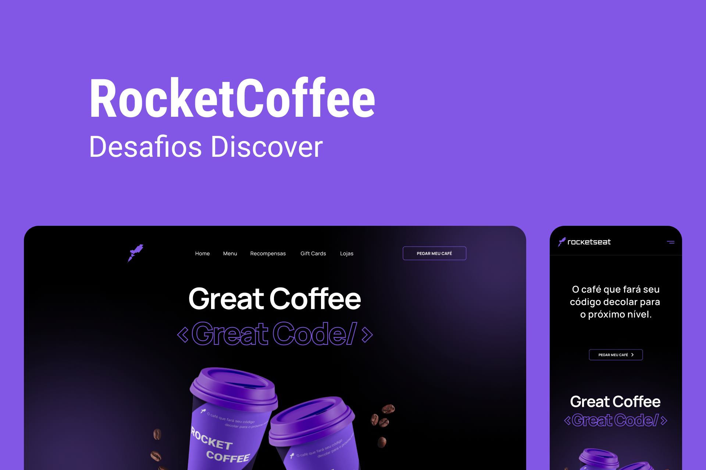

# RocketCoffee

Desafio discover - rocketseat

<br />

## Capa

 <br/> <br/>

## Stack

- React
- Tailwind css

## Design da aplicação

- Clique [aqui](https://www.figma.com/file/tFoovGllUttTebdUTDVdT8/RocketCoffee/duplicate) para acessar o Layout no Figma
- Clique [aqui](https://efficient-sloth-d85.notion.site/Desafio-RocketCoffee-7802895f0dd44da5a6f71a64badc7e72) para acessar o Notion do desafio

<br />

## Como executar a aplicação

### Instalação

1. Clone o repositório

```bash
git clone https://github.com/FixRuan/RocketCoffee
```

2. Acesse a pasta do projeto

```bash
cd RocketCoffee
```

3. Instale as dependências necessárias

```bash
yarn
```

4. Execute o projeto

```bash
yarn dev
```
